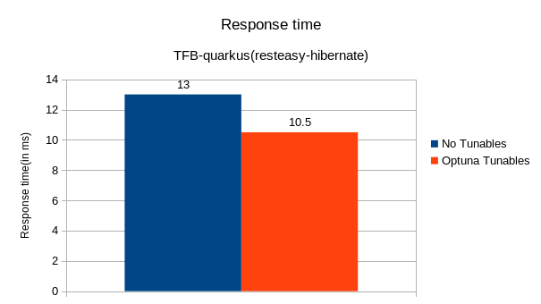

## All the experiments in this folder were run on shared infrastructure and require to be validated on a dedicated infrastructure. Manual runs are being run to reproduce the data with the best configuration which will be updated at [manuals](https://github.com/kruize/autotune-results/tree/main/techempower/experiment-1/manuals) dir.


# Summary of data
- 19.2% reduced response time with optuna optimization tunables.
- Min response time is observed with following configuration
```
   [Layer]            [Tunable]              [Default, Range]    Best Config
[Quarkus]   quarkus.thread-pool.core-threads   [1, 1-3]            =   2
[Quarkus]   quarkus.thread-pool.queue-size     [unbounded, 1-100]  =  58
[Quarkus]   quarkus.datasource.jdbc.min-size   [0, 0-10]           =   5
[Quarkus]   quarkus.datasource.jdbc.max-size   [20, 20-50]         =  28
[Hotspot]   maxinlinelevel                     [9, 9-50]           =  12
[Container] cpuRequest                         [None, 1-3.2]       =  1.38
[Container] memoryRequest                      [None, 270M-1024M]  =  957M
```
Note: Best configuration from multiple trials is picked based on having least response time, no errors while running the load and ensuring the data has met the convergence criteria.

Below graph is the comparison of response_time metric with best configuration from the experiment and the baseline.


Below graphs represents different metrics data for each trial during the experiment. Each trial would have an individual configuartion based on the tunables.For information on the configuration of a particular trial, look into experiment-data.csv


